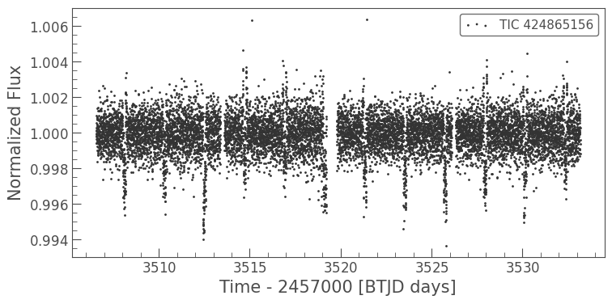
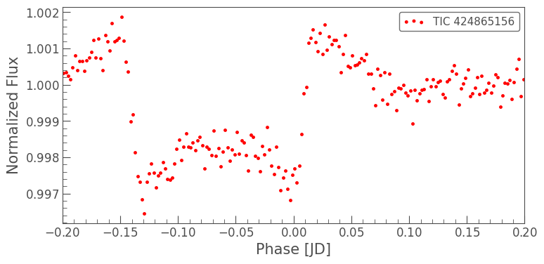

# tess-exoplanet-transit-analysis
A small personal project using python to detect exoplanet using the TESS data and characterize the signal using python libraries like numpy, matplotlib, lightkurve.
# Project Overview
This project shows the detection of an _exoplanet_ and analysis of _transit_ using photometric light curve data from the **TESS(Transiting Exoplanet Survey Satellite)** mission.

Using Python and `lightkurve` package, the light curve of **HAT-P-7** was analyzed to identify a dip in the stellar brightness caused by an orbiting planet in front of the host star.

This project involves performing basic processing and analysis which includes:
- Downloading TESS light curve data
- Removing outliers
- Flattening
- Phase folding the light curve
- Binning the data to improve clarity
- Measuring transit depth
- Estimation of planet to star radius

# Target System
- **Star**: HAT-P-7
- **TESS Identifier**: TIC 424865156
- **Planet**: HAT-P-7 b
- **Orbital Period**: 2.20473 days

HAT-P-7 b is a _hot jupiter_, a gas giant planet orbiting very close to its host star.

# Methods of Processing
## Data retrieval:
Light curve data was downloaded using **Lightkurve** library from the TESS mission archive
## Data cleaning:
Outliers were removed to eliminate instrumental noise and anomalous data points
## Light Curve Flattening:
Long term stellar variability was removed using the flatten() method
## Phase folding:
the light cuve was folded using the known orbital period of the planet to align multiple transits
## Binning:
Phase folded data was binned to reduce noise and clearly reveal the transit shape
## Transit depth measurement:
The transit depth was calculated using the minimum normalized flux value.
*Transit depth formula*
depth = 1 - F_min
## Planet to star ratio:
The ratio between the planet radius and stellar radius is found using:
  Rp/Rs = √(Transit Depth)
# Tools and Libraries
- `Python`
- `numpy`
- `lightkurve`
- `matplotlib`
- `astropy`
- `jupyter notebook`
# Transit Curve
### Raw Light Curve

### Binned Transit

# Result 
- Measured Transit Depth: **0.0063**
- Planet to star Radius ratio: Rp/Rs ≈ **0.0795**

